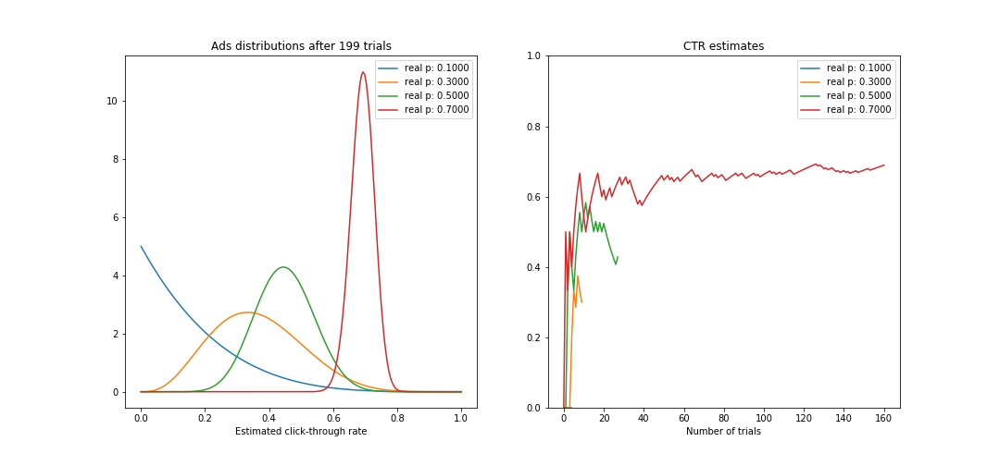

# Consumer profiling using k-means clustering

A/B testing is an experimental approach to comparing multiple versions of a product, such as a web-page or a new type of pet-food. This allows data-driven decisions on the development of the product based on the measure of interest (eg, volume of sales).

Here, I briefly show an implementation of a traditional A/B testing analysis, and a bayesian A/B test setup for presenting web advertisements on-line based on their click-trough rate.

---
Click on "notebook.ipynb" to see the step-by-step analysis with explanations and code.
Data for this project, as well as many ideas for the analysis, were provided by the online course Bayesian machine learning in python (https://www.udemy.com/bayesian-machine-learning-in-python-ab-testing/)

 

