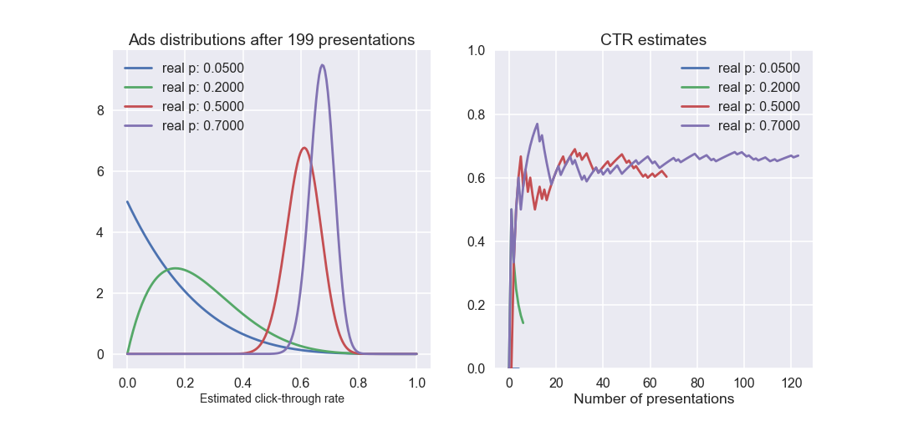

# A/B testing

A/B testing is an experimental approach to compare multiple versions of a product, such as a web-page or a new type of pet-food. This allows data-driven decisions on the development process, which is always preferable than the famous gut feeling!

Here, I first briefly show an implementation of a traditional A/B testing analysis that uses a simple statistical test to verify an hypothesis. Next, I implement a bayesian A/B test setup for presenting web advertisements on-line based on their click-trough rate. This adaptive approach is becoming more and more common, particularly in e-commerce.

---
Click on "notebook.ipynb" to see the step-by-step analysis with explanations and code.
Data for this project, as well as many ideas for the analysis, were provided by the online course Bayesian machine learning in python (https://www.udemy.com/bayesian-machine-learning-in-python-ab-testing/)

 

