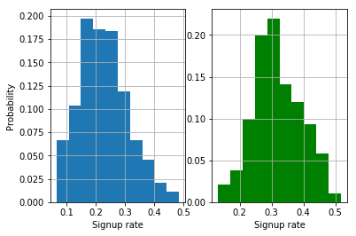

# Bayesian inference

This notebook is about bayesian inference. Bayesian inference is a probabilistic approach to data analysis greatly appreciated thanks to its ability to quantify the uncertainty in the data. Moreover, it allows to include sources of information other than the data (eg, the opinion of an expert). 

In this notebook we will use approximate bayesian computation to inver the signup rate to an ad based on a few data. Next, we will use a similar approach to compare two ads and see if one outperforms the other. This nicely combines with an older notebook on Bayesian A/B testing from this repository, where we described how to setup bandit algorithms.

This notebook is inspired by the tutorial from https://github.com/rasmusab/bayesianprobabilitiesworkshop/blob/master/Exercise%201.ipynb

---

---
Click on "bayesian_inference.ipynb" to see the step-by-step analysis with explanations and code.
This notebook is inspired by the tutorial from https://github.com/rasmusab/bayesianprobabilitiesworkshop/blob/master/Exercise%201.ipynb

 

