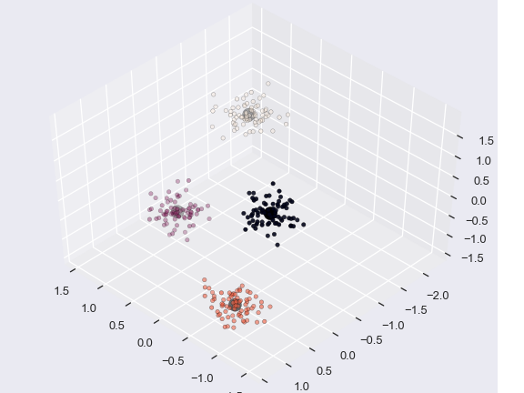

# A/B testing

Today I wanted to tackle the problem of profile users, i.e., dividing a group of users into different categories based on, for instance, their product or service preferences. One way to do this is by identifying groups (or clusters) in a way that users in the same group are more similar to users in other groups. 

One popular algorithm that serves this purpose is the k-means clustering algorithm. These algorithms are particularly suited for these problems as they can learn stractures from data that are not labelled beforehand.

---
Click on the nootbook "kmeans_analysis.ipynb" to see the step-by-step analysis with explanations and code.

 

