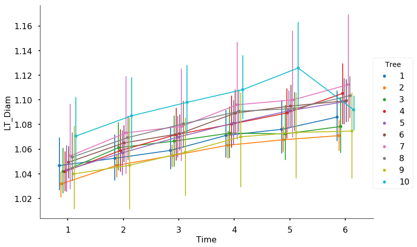

# Linear mixed-effects models

Linear models are widely employed for hypothesis testing due to their ability to simultaneously model the influence of different factors on the dependent variable under investigation. Linear models describes the process that generated the measurments of the dependent variable as if it were composed by a stochastic term (error) and by an effect of the considered factors. Hence, linear models essentially divide the world into things that we somehow understand or that are somehow systematic (the fixed effects), and things that we cannot control for or that we don’t understand (error). 

Mixed models add more structure to the error term by modelling effects that are not fixed when measurements are generated, but rather  can vary depending on the specific factor that generated the measurement. A typical choice when dealing with studies including multiple measurements from multiple participants is to model the participant as a random factor, to reflect differences (idiosyncrasies) across different participants. Indeed, participants are randomly selected from a population of different individuals!

An intuitive introduction to mixed-effects model can be found at http://www.bodowinter.com/tutorial/bw_LME_tutorial2.pdf

---
Click on the nootbook file "JAR_analysis.ipynb" to see the step-by-step analysis, with more plots, tables and the code. 
Data for this project were downloaded from http://www.growthmodel.org/mixedmodels/mixedmodels.htm

 

