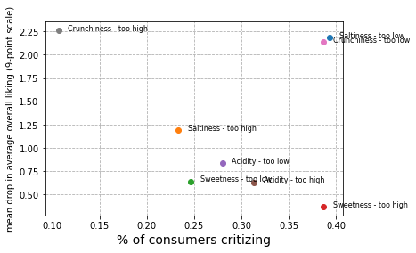

# Just-About-Right scales and penalty analysis

Just-about-right (JAR) scales measure the appropriateness of the level of a specific attribute, and are used to determine the optimum levels of attributes in a product. when JAR data are collected together with preference data (or liking scores, or hedonic judgements), a penalty analysis can provide DIRECTIONAL information for product reformulation or optimization.

Penalty analysis links attributes and overall liking/acceptability,to determine if those respondents who found the product not satisfactory on an attribute do rate it overall lower. It can therefore quantify the impact that improving an attribute can have on overall liking, and proceed with recommandations for changes.

 
