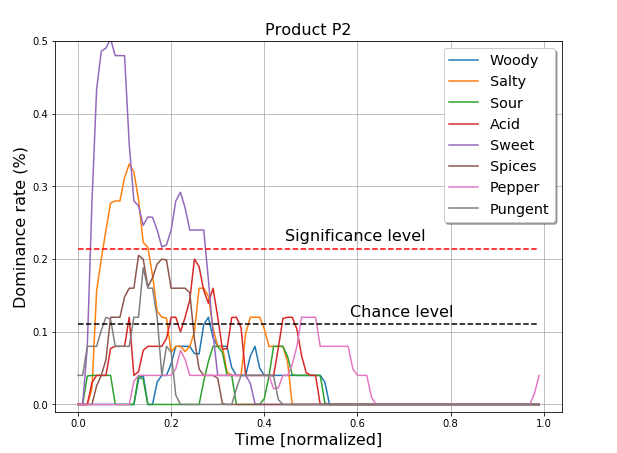

# Temporal Dominance of Sensations

Temporal dominance of sensations (TDS) is a techniques to study the temporal aspects of sensory perception, and is widely employed in the characterization of food products.

Common methods for sensory profiling generally ask assesors to rate attributes only at the end of the tasting, and do not therefore consider the temoporal aspects of sensory attributes. However, products with similar final ratings may differ in the perceptual evolution of the sensory attributes. TDS consists in presenting assesors an attribute list on a computer screen, and asking them to determine which sensation is dominant. Assessors are asked to select a new attribute when the dominant sensation changes, until the tasting is over.

Click on the nootbook file "analysis.ipynb" to see the step-by-step analysis, with more plots, tables and the code. For this project, I followed the analysis procedure described in chapter 13 of the book "Novel techniques in sensory characterization and consumer profiling".

Data for this analysis are downloaded from https://help.xlstat.com/customer/en/portal/articles/2452182-temporal-dominance-of-sensations-tds-in-excel?b_id=9283. 

 
