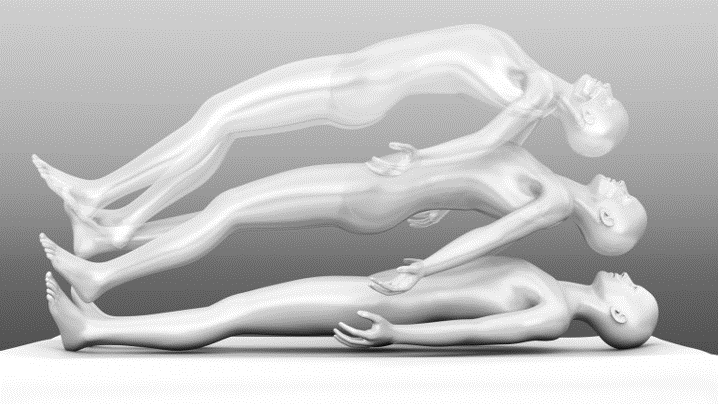
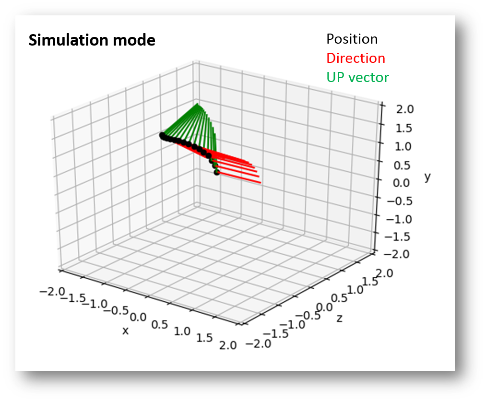
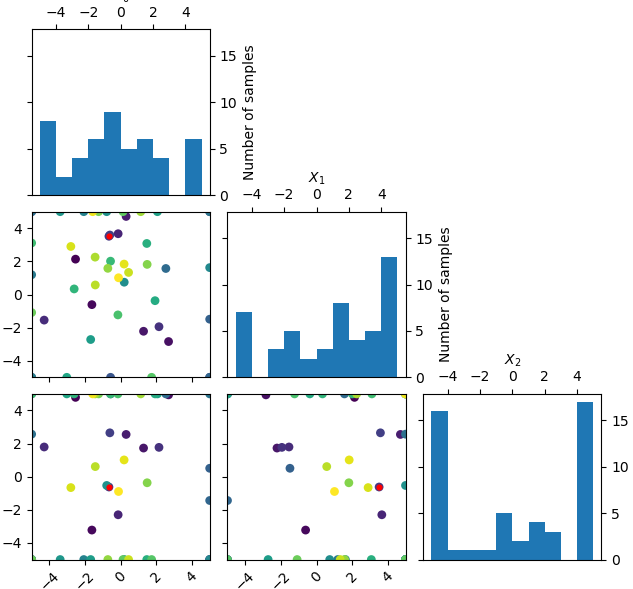
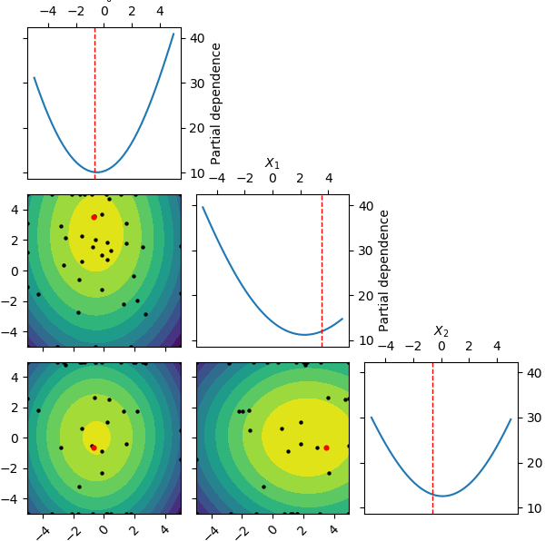

# Virtual Out-of-Body experiences
This is an interesting and ambitious project that aims at studying Out-of-body experiences (OBEs). 
OBEs are rich and complex multisensory experiences consisting in the feeling of perceiving the world from a location outside one's physical body. They are commonly reported by neurological patients inclined to sensory hallucinations.
We (neuroscientists) believe that studying the perceptual mechanisms underlying OBEs can help us understanding how our brain internally represents our physical body, and how this contributes to making us aware of our actions and experiences.

In this project we intend to recreate the richness and complexity of spontaneous OBEs in virtual reality, and develop a machine learning procedure that will iteratively optimize consequent presentations, effectively personalizing the virtual OBE to the individual participant.
mThe stimulus selection algorithm will rely on Bayesian Optimization, sample-efficient and noise-tolerant global optimization algorithm. in the current version of the experiment, we employ the python library scikit-optimize (https://github.com/scikit-optimize/scikit-optimize).
The visual component of the virtual experience is recreated using a 3d body scanner (10 kinects) and a customized software that renders virtual environments on head-mounted displays. .
Artistic representation of an OBE

Trajectory of the virtual camera during a typical experimental trial

Simulated results for an experiment where 3 different stimulus properties where optimized. 
The plots show the evaluations and the partial dependences of the 3 parameters. Partial dependences are a way to visulize how the value of 1 or 2 specific attributes influences the average predicted values y, REGARDLESS of the values taken by the other parameters (marginalization).

