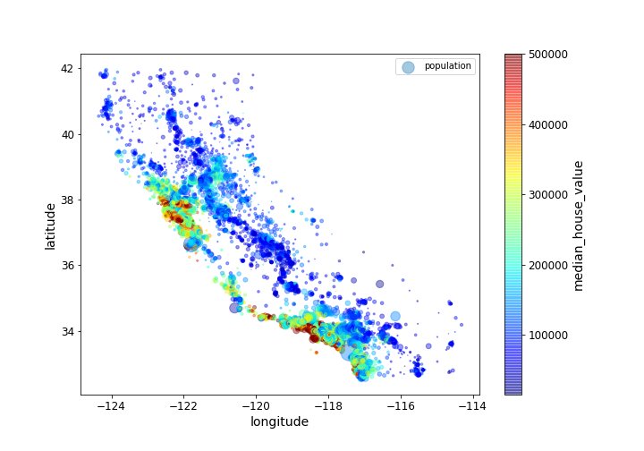

# Housing prices

Predicting the price of a house is a typical example of a machine learning project. 
Here, I will analyse a dataset containing information on houses in the Bay area. since among these there is also the actual price of the houses, the problem is a supervised problem, and we will approach it as a myltivariete regression problem. Importantly, we will not only focus on the machine learning algorithms, but rather spend a significant amount of time preparing the data. This will highlight the importance of visual inspections, correlation analyses, preparation of categorical variables, and so on.

---
Click on the nootbook file "analysis.ipynb" to see the step-by-step analysis, with many explanatory comments, plots, tables and the code. 
For this project, I followed the analysis procedure described in chapter 2 of the book "Hands-on machine learning with scikit-learn and tensorflow".

 

 

